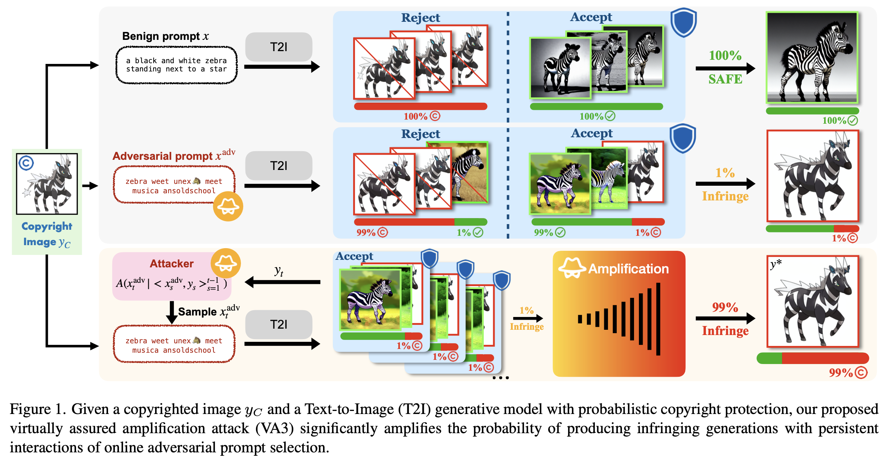
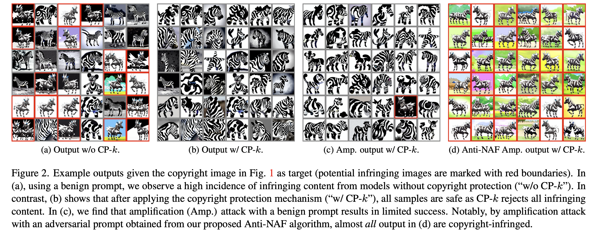

# VA3
Official Code for "VA3: Virtually Assured Amplification Attack on Probabilistic Copyright Protection for Text-to-Image Generative Models" (previous name on arxiv: "Probabilistic Copyright Protection Can Fail for Text-to-Image Generative Models")
CVPR 2024 (Highlight)



We introduce Virtually Assured Amplification Attack (VA3), a novel online attack framework that exposes the vulnerabilities of probabilistic copyright protection mechanisms. The proposed framework significantly amplifies the probability of generating infringing content on the sustained interactions with generative models and a lower-bounded success probability of each engagement. Our theoretical and experimental results demonstrate the effectiveness of our approach and highlight the potential risk of implementing probabilistic copyright protection in practical applications of text-to-image generative models.



## Requirements

The code is based on PyTorch and HuggingFace `transformers` and `diffusers`.

````bash
pip install -r requirements.txt 
````

## Checkpoints

The q1 and q2 models for target image in Figure 1 can be downloaded at [Google Drive](https://drive.google.com/drive/folders/1UMeCJVpJCKJG6qSMEt5aS-obQKsrWZJ9?usp=sharing). You can download and unzip them to `./ckpts`.

SSCD model for evaluation can be downloaded at [Github-SSCD](https://github.com/facebookresearch/sscd-copy-detection).

## Anti-NAF Optimization

````bash
bash ./scripts/run_anti_naf.sh
````

Arguments:

- `--target_image_path`: the path to the target copyrighted image
- `--path_model_1`: the path to q1 model (with access to target copyrighted image)
- `--path_model_2`: the path to q2 model (without access to target copyrighted image)


## Sampling

````bash
bash ./scripts/run_sample.sh
````

Arguments:

* `--mode`: sampling mode: cpfree (half chance sample from q1 or q2), model_1 (sample from q1 only), model_2 (sample from q2 only)
* `--prompt`: the prompt for sampling 
* `--num_images`: the number of images per batch
* `--sample_times`: the number of sampling times 


## Evaluation

### Evaluation on single prompt:

````bash
bash ./scripts/run_eval.sh
````

Arguments:

* `--ar`: the acceptance rate
* `--sim_thres`: the similarity score threshold for copyright infringement judgment 
* `--num_samples`: the number of samples for evaluation
* `--amp_steps`: the number of amplification steps
* `--sample_path`: the path to the samples for evaluation
* `--example_num`: the number of example images for demonstration

### Evaluation on prompt selection:

````bash
bash ./scripts/run_eval_bandit.sh
````

Additional arguments:

* `--bandit_mode`: choose from 'max' for $\varepsilon$-greedy-max and 'cdf' for $\varepsilon$-greedy-cdf
* `--candidates_name`: prompt candidates names under the sample directory, seperated by comma
* `--eps`: the initial value of  $\varepsilon$
* `--eps_mode`: the mode for $\varepsilon$: 'fix', 'linear' (linearly decreased), 'exp' (exponentially decreased)
* `--m`: the trial number for each arm

